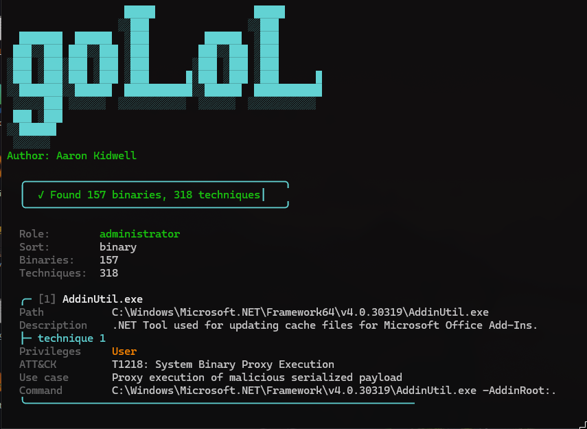

# goLoL

**goLoL** is a Windows host scanner with dual support for **[LOLBAS](https://lolbas-project.github.io/)** binaries and **[LOLDrivers](https://www.loldrivers.io/)**. It lists LOLBAS techniques runnable at your current privilege level (with MITRE ATT&CK mappings) and can scan local `.sys` files for vulnerable/malicious LOLDrivers hash matches.
**Note:** This is not an OPSEC safe tool.
**Author:** Aaron Kidwell

```
                   █████                █████      
                  ░░███                ░░███       
  ███████  ██████  ░███         ██████  ░███       
 ███░░███ ███░░███ ░███        ███░░███ ░███       
░███ ░███░███ ░███ ░███       ░███ ░███ ░███       
░███ ░███░███ ░███ ░███      █░███ ░███ ░███      █
░░███████░░██████  ███████████░░██████  ███████████
 ░░░░░███ ░░░░░░  ░░░░░░░░░░░  ░░░░░░  ░░░░░░░░░░░ 
 ███ ░███                                          
░░██████                                           
 ░░░░░░                                            

```



## Features

- **Live LOLBAS catalog**: pulls the latest entries from [lolbas-project.github.io](https://lolbas-project.github.io/api/lolbas.json)
- **On-disk detection**: resolves documented paths to local `%WINDIR%`, `%ProgramFiles%`, `%USERPROFILE%`, and WindowsApps locations
- **Privilege-aware filtering**: shows only techniques runnable at your current tier
- **MITRE ATT&CK labels**: technique IDs mapped to readable names (e.g. `T1003.003: NTDS`)
- **Flexible sorting**: group by binary, privilege tier, or ATT&CK technique
- **Driver mode**: hashes local `.sys` files and matches against the live [LOLDrivers](https://www.loldrivers.io/) JSON catalog
- **Plain output mode**: ASCII-only output for telnet, reverse shells, and other unstable terminals
- **Lightweight scanning**: filesystem checks via Go APIs; admin-group detection uses `net localgroup` (one child process on Windows)

## Privilege tiers

| Your context | What you see |
|---|---|
| Standard user | User-tier techniques |
| Member of local **Administrators** | User-tier + admin-tier techniques |
| **NT AUTHORITY\\SYSTEM** | User-tier + admin-tier + SYSTEM-tier techniques |

Admin-tier commands may still require an elevated shell even if your account is in the Administrators group. SYSTEM-tier entries are hidden unless the process token is SYSTEM (`S-1-5-18`).

## Requirements

- **Windows** (primary target; non-Windows builds stub out privilege checks)
- **Go 1.21+** (project uses Go 1.26.2)
- **Network access** to fetch LOLBAS/LOLDrivers catalogs on each run (not cached offline)

## Install

**Remote install** (requires a tagged release on GitHub, e.g. `v0.1.0`):

```bash
go install github.com/aaron-kidwell/goLoL@latest
```

The binary is placed in your `GOPATH/bin` (or `~/go/bin`). On Windows, ensure that directory is on your `PATH`.

**Clone and build:**

```bash
git clone https://github.com/aaron-kidwell/goLoL.git
cd goLoL
go build -ldflags="-s -w" -trimpath -o golol.exe .
```

## Usage

`goLoL` supports two scan modes:
- **LOLBAS mode (default)** for living-off-the-land binaries and privilege-filtered techniques
- **LOLDrivers mode** via `-driver` for vulnerable/malicious driver hash matches

Run from the module root (required for `internal/` packages):

```bash
go run .
```

Build a binary (recommended.. strips debug info, ~30% smaller):

```bash
go build -ldflags="-s -w" -trimpath -o golol.exe .
.\golol.exe
```

`-s -w` removes the symbol table and DWARF debug data. A default `go build` on this project is ~9.5 MB; with those flags it drops to ~6.4 MB.

### Flags

| Flag | Description |
|---|---|
| `-h`, `-help` | Show help |
| `-driver` | Scan local drivers and list known vulnerable/malicious matches from LOLDrivers |
| `-plain` | ASCII-only output (no colors, Unicode, or cursor control) |
| `-s`, `-search` | Show one binary by name (`certutil` or `certutil.exe`); reports if not on disk |
| `-sort` | Sort results: `binary` (default), `privilege`, or `attack` |

Sort aliases: `b`, `priv` / `p`, `mitre` / `a`. Invalid values print an error and show help.

### Examples

```bash
# Default: grouped by binary name (A-Z)
go run .

# Driver mode (scan local .sys files against LOLDrivers hashes)
go run . -driver

# Look up a single binary
go run . -s certutil
.\golol.exe -s certutil.exe

# Admin tier first, then user tier (SYSTEM tier first when running as SYSTEM)
go run . -sort privilege

# Sorted by MITRE ATT&CK ID
go run . -sort attack

# Reverse shell / telnet friendly output
go run . -plain

# Combine flags
go run . -plain -sort attack
```

### Example output

Counts and binaries vary by host. The screenshot at the top of this README shows interactive mode (colored terminal, grouped by binary).

**Plain mode** (`-plain`):

```
[*] Checking process token...
[*] Fetching LOLBAS catalog...
[+] Found 147 binaries, 299 techniques

==============================================================
Role:        administrator
Sort:        binary
Binaries:    147
Techniques:  299
==============================================================

  [1] Esentutl.exe
  Path:          C:\Windows\System32\esentutl.exe
  ...
```

## How it works

1. Detects the current process privilege context (standard user, local admin group member, or SYSTEM).
2. In default mode, downloads and parses the LOLBAS JSON catalog.
3. For each LOLBAS entry, remaps documented paths to the local filesystem and checks whether the binary exists.
4. Filters commands by privilege tier and deduplicates by resolved on-disk path.
5. In `-driver` mode, downloads the LOLDrivers JSON catalog, hashes local `.sys` files, and reports hash matches.
6. Prints results with paths, ATT&CK technique, use case, and example command (or driver match metadata in `-driver` mode).

| Component | Location |
|---|---|
| LOLBAS catalog | `https://lolbas-project.github.io/api/lolbas.json` |
| LOLDrivers catalog | `https://www.loldrivers.io/api/drivers.json` |
| Privilege detection | `internal/privileges` |
| MITRE technique names | `internal/mitre` |
| Path resolution & output | `main.go` |

## Project layout

```
.
├── docs/
│   └── screenshot.png            # README screenshot
├── main.go
├── internal/
│   ├── mitre/
│   │   └── names.go              # MITRE ATT&CK ID to label map
│   └── privileges/
│       ├── privileges_windows.go # Token / Administrators group checks
│       └── privileges_stub.go    # Non-Windows stub
├── go.mod
└── go.sum
```

## Disclaimer

For **authorized** security testing, lab use, and education only. Only run against systems you own or have explicit permission to assess. LOLBAS entries describe techniques that may be abused by attackers, so use responsibly. The author is not responsible for misuse.

Technique and metadata are sourced from the [LOLBAS Project](https://github.com/LOLBAS-Project/LOLBAS) and [LOLDrivers](https://github.com/magicsword-io/LOLDrivers). goLoL is not affiliated with or endorsed by either project.

## License

MIT
